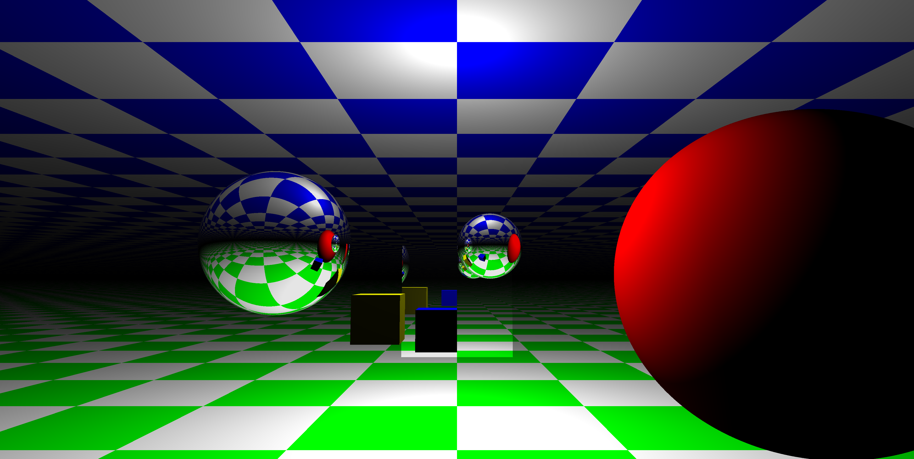

# Ray tracing in Rust

This is a ray tracer written in Rust. It was written as a side project to experiment with ray tracing and Rust.

If you are interested in working with us, go to https://www.niloen.com

